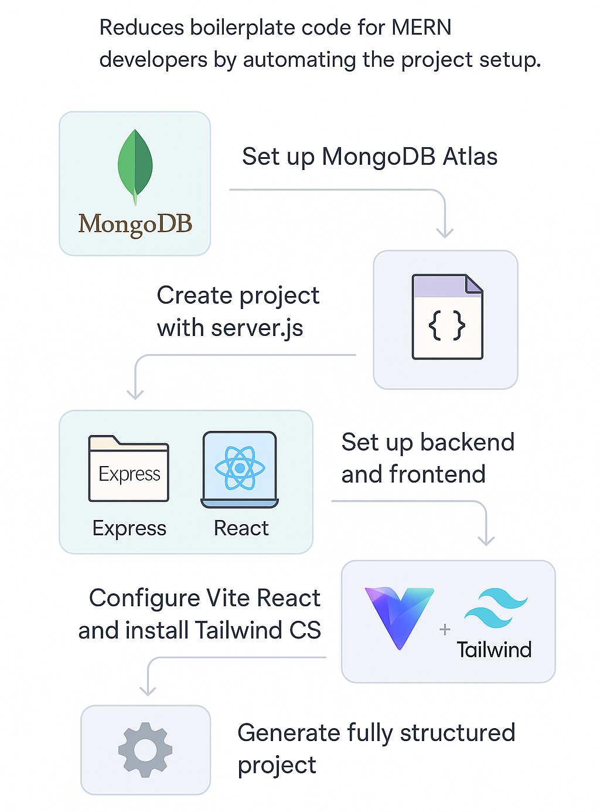

<p align="center">

</p>  

<div align="center">

# MERNBoot 🚀

[](https://www.npmjs.com/package/mernboot)
[](https://www.npmjs.com/package/mernboot)
[](https://www.npmjs.com/package/mernboot)

🎯 Generate production-ready MERN stack applications in minutes. Automated MongoDB Atlas setup, pre-configured Express backend, and modern React frontend with Tailwind CSS - all with one command! ✨

</div>

## 🚀 Quick Start

```bash
# Create a new MERN project
npx mernboot my-app

# Or install globally
npm install -g mernboot
mernboot my-app
```

## ✨ Features

### 1. MongoDB Atlas Integration

- 🔄 Automated cluster creation
- 🔑 Secure authentication setup
- 📊 Database configuration
- 🔌 Connection string management

### 2. Express Backend

- 📁 MVC architecture
- 🛣️ Pre-configured routes
- 🔒 Middleware setup
- 🎯 Best practices structure

### 3. React Frontend

- ⚡ Vite for blazing fast development
- 🎨 Tailwind CSS pre-configured
- 📱 Responsive layouts
- 🎯 Modern development setup

### 4. Development Tools

- 🔄 Hot reloading
- 📝 Environment variables
- 🛠️ Concurrent development servers
- 📦 Dependency management

## 📋 Project Structure

```
my-app/
├── client/                # React Frontend
│   ├── public/
│   ├── src/
│   │   ├── components/
│   │   └── App.jsx
│   └── package.json
│
|                         # Express Backend
│── controllers/
│── models/
│── routes/
│── middleware/
│── server.js
│
├── .env                 # Environment Variables
└── package.json
```

## 🛠️ Step-by-Step Guide

### 1. Create Your Project

```bash
npx mernboot my-app
cd my-app
```

### 2. MongoDB Setup

```bash
# Choose MongoDB Atlas Setup from the menu
# Follow the interactive prompts for:
# - Project creation
# - Cluster setup
# - Database user configuration
```

### 3. Start Development

```bash
# Start both frontend and backend
npm run dev:all

# Or start them separately
npm run dev:server  # Backend only
npm run dev:client  # Frontend only
```

## 💻 Commands

| Command              | Description                     |
| -------------------- | ------------------------------- |
| `npm run dev:all`    | Start both frontend and backend |
| `npm run dev:server` | Start backend only              |
| `npm run dev:client` | Start frontend only             |
| `npm run build`      | Build frontend                  |
| `npm start`          | Start production server         |

## ⚙️ Configuration

### Environment Variables

```env
PORT=5000
MONGODB_URI=your_mongodb_uri
NODE_ENV=development
```

### Available Options

- MongoDB Atlas configuration
- Custom port settings
- Development/Production modes
- CORS settings

## 📚 Requirements

- Node.js 14.0 or later
- npm 6.0 or later
- MongoDB Atlas account (free tier works great!)

## 🤝 Contributing

1. Fork the repository
2. Create your feature branch (`git checkout -b feature/AmazingFeature`)
3. Commit your changes (`git commit -m 'Add some AmazingFeature'`)
4. Push to the branch (`git push origin feature/AmazingFeature`)
5. Open a Pull Request

## 📝 License

This project is licensed under the MIT License - see the [LICENSE](LICENSE) file for details.

##  Acknowledgments

- MongoDB Atlas for database hosting
- Express.js for backend framework
- React for frontend library
- Node.js for runtime environment
- Tailwind CSS for styling

## 📮 Support

Having trouble? Open an issue or reach out to us:

- [GitHub Issues](https://github.com/thejaAshwin62/mernboot/issues)
- [Email Support](mailto:your-email@example.com)

---

<div align="center">
Made with ♾️ by Theja Ashwin
</div>
